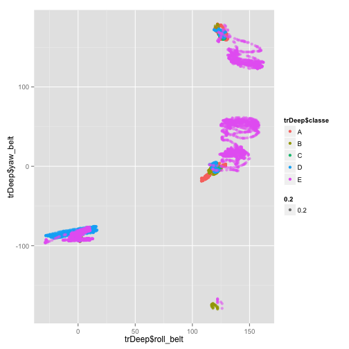
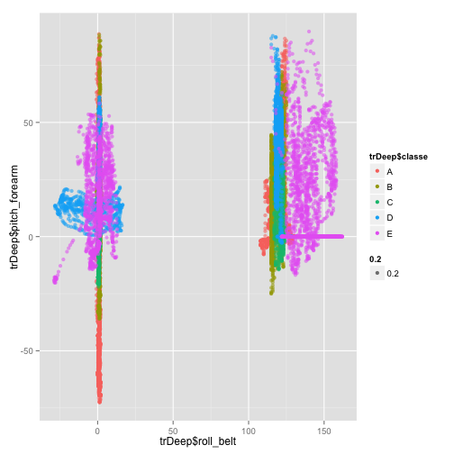

## Summary

A random-forest trained algorithm, using only sensor data from columns fully populated with data (no NAs), shows the best suitability (among 3 candidates) for predicting the exercise type from the given information. This was verified using cross-validation with a 60/40 split between training and validation data. The expected out-of-sample accuracy is over 99%, which makes the algorithm general enough that extra components related to time and person can be ignored.


## Preparation

I'll use knitr for generating this report, caret for running the machine learning, lubridate to handle date data (if I need it), and doParallel to run computations in parallel when I can. I'll use caching in this document because the calculations can be very time-consuming. I'll also use the training function from the caret-independent *randomForest* library, which showed much better performance (speed) than R's built-in `train` function with `method="rf"`.


```r
library(knitr)
library(lubridate)
library(caret)
library(doParallel)
library(randomForest)
options(digits=3)

opts_chunk$set(cache=TRUE)

set.seed(989686)
```

### Training data import

I import the training 'as-is' from the given source---i.e. I will determine factor variables manually: `classe` and `user_name`. Blank fields, and fields marked "NA" or "#DIV/0!" will all be treated as missing or NA values.


```r
training <- read.csv("pml-training.csv",
    na.strings=c("NA", "", "#DIV/0!"),
    as.is=TRUE)
training$classe <- factor(training$classe)
training$user_name <- factor(training$user_name)
```

I can also get rid of columns that are always NA, since there's obviously no usable data there.


```r
training <- training[,as.vector(colSums(is.na(training)) != length(training$X))]
```

### Split the data based on full or sparse data

There are a lot of columns where the data is NA most of the time, and only show usable data in about 200/19000 rows, or 1% of the time. This could be useful, but for now I'll try to get by with just the densely-populated data.

I split the training set into two sets:

1. "deep", with fewer columns but all 19k rows, and
2. "wide", the much more limited set of rows with complete cases.

In "wide", I also remove a few more of the columns where the value is always the same. I'll convert `cvtd_timestamp` into a lubridate object in case I need it later.


```r
fullCols <- as.vector(colSums(is.na(training)))==0 & as.vector(colSums(training==""))==0
training$cvtd_timestamp <- parse_date_time(training$cvtd_timestamp, "%d/%m/%Y %H:%M")

trDeep <- training[, fullCols]
trDeep <- trDeep[complete.cases(trDeep), ]
```

I'll set the 200 or so 'wide' rows with complete cases aside in their own table, `trWide`, and will then use a single binary (boolean) indicator column in `trDeep` to track whether the row is a complete case or not. I'll see how far I can get with just the narrow (deep) data and the flag as a placeholder for wide rows. If I need the wide (shallow) data for more accuracy, I'll work on bringing it back in later.


```r
trWide <- training[complete.cases(training),]
trWide <- Filter(function(x)(length(unique(x))>1), trWide)

trDeep <- cbind(0,trDeep)
colnames(trDeep)[1] <- "wideRow"
trDeep$wideRow[trWide$X] <- 1
```

### Partitioning training and test data

Training and validation data are split 60/40 with even distribution of `classe` between them.


```r
trvec <- createDataPartition(trDeep$classe, p=0.6, list=FALSE)
trDeep_tr <- trDeep[trvec,]
trDeep_ts <- trDeep[-trvec,]
```

### Which variables?

Most of the columns in `trDeep` are sensor data, except for several at the beginning. I'll leave out the non-sensor variables, since they are likely to contribute to over-fitting. These include:

- timestamps: these are the most dangerous for over-fitting. I don't want my algorithm to expect certain activity to occur at a certain date-time.
- apparent programming overhead information (`new_window`, `num_window`): this is probably only coincidental to the activity taking place.
- `user_name`: the grayest case. It seems likely that a user+sensor data combination is more powerful at prediction than sensor data alone, but I prefer to see how far I can do with just the motion data first, and then incorporate user information later if needed.

Since `wideRow` is a placeholder for sensor data, I'll include it and check its importance after the first training attempt.


### Try 1: Random Forest

I start by running the training on the 'deep' training portion of the training set, `trDeep_tr`, with only sensor data (including the `wideRow` placeholder at column index 1).

"Random forest" is the default training method in caret. It is reportedly very good for predictive accuracy. The disadvantage is speed and over-fitting. The speed issue is addressed by using the `randomForest()` function from the randomForest library, instead of caret's built-in `train()` function with `method='rf'` (the results are nearly the same, but the non-caret function takes a fraction of the time to run). Over-fitting will be addressed by cross-validation with the non-training data (`trDeep_ts`).


```r
registerDoParallel(cores=2)
trainedRf <- randomForest(classe ~., data=trDeep_tr[,c(-2:-8)])
```

I can measure in-model accuracy by checking the confusion matrix against the training set:


```r
cmRfIn <- confusionMatrix(trDeep_tr$classe, predict(trainedRf, trDeep_tr[,c(-2:-8)]))
```

`randomForest()` built a model with perfect in-model accuracy (1) with the training data. Now let's check out-of-sample error with cross-validation against the validation set `trDeep_ts`:


```r
predictRf <- predict(trainedRf, trDeep_ts[,c(-2:-8)])
cmRf <- confusionMatrix(trDeep_ts$classe, predictRf)
cmRf$table
```

```
##           Reference
## Prediction    A    B    C    D    E
##          A 2225    6    0    0    1
##          B    8 1508    2    0    0
##          C    0   13 1351    4    0
##          D    0    0   18 1268    0
##          E    0    0    1    0 1441
```

This out-of-sample accuracy of 99.324% might be as good as it gets. An expected 99.324% accuracy out-of-sample is more than likely to predict 20 similar cases correctly. I'll still try out a few other algorithms for the sake of comparison and curiosity.

### Aside: significance of `wideRow`s

I check the importance of each variable used, including `wideRow`, using `varImp()`:


```r
variableImportance <- varImp(trainedRf)
```

`wideRow`'s importance of 0.436 turns out to be the lowest of all the included predictor variables. Here are the next few importance rankings:


```r
sort(variableImportance$Overall)[1:6]
```

```
## [1]  0.436 37.712 46.002 51.345 53.772 60.393
```

It looks like `wideRow` is about 1% as influential as the next-least important variable, so I will continue with well-populated data in `trDeep` only.


### Try 2: Boosting

The spatial-position-to-classification element of boosting makes it a good candidate for comparison. On `trDeep`, this amounts to locating a point in a 50-dimensional space and classifying it based on its position. It feels like a good fit, intuitively.

Looking at only the two most important variables from the randomForest approach, `roll_belt` and `yaw_belt`, there's already a noticeable pattern based on their postions and `classe`.

 

Add in the next one, `pitch_forearm` and it's apparent that knowing all of these spatial variables is likely to reveal sufficient pattern for accurate predctions.

 

I'll train an algorithm with the tree-based boosting model, `gbm`, which was effective based on the same principle with the iris data set in course lectures.


```r
trainedGbm <- train(classe ~., data=trDeep_tr[,c(-1:-8)], method="gbm", verbose=FALSE)
```

Now look at the in-sample accuracy:


```r
cmGbmIn <- confusionMatrix(trDeep_tr$classe, predict(trainedGbm, trDeep_tr[,c(-2:-8)]))
```


In-sample accuracy is 97.368%. I check out-of-sample accuracy by cross-validating against the (pre-)testing data:


```r
predictGbm <- predict(trainedGbm, trDeep_ts[,c(-1:-8)])
cmGbm <- confusionMatrix(trDeep_ts$classe, predictGbm)
cmGbm$table
```

```
##           Reference
## Prediction    A    B    C    D    E
##          A 2192   28    8    3    1
##          B   43 1432   37    6    0
##          C    0   57 1284   25    2
##          D    2    8   45 1227    4
##          E    4   18   11   17 1392
```

The out-of-sample accuracy, 95.934%, is also quite good, but the random-forest based algorithm still looks better.


### Try 3: `rpart` regression/classification trees

It might be possible to use R's default tree-based method.


```r
registerDoParallel(cores=1) # fails on 2 cores
trainedRpart <- train(classe ~., data=trDeep_tr[,c(-1:-8)], method="rpart")
```

Again, looking at the in-sample error:


```r
cmRpartIn <- confusionMatrix(trDeep_tr$classe, predict(trainedRpart, trDeep_tr[,c(-2:-8)]))
```

In-sample accuracy of 49.822% is not at all promising. Out-of-sample accuracy checked with cross-validation is worse, as expected.


```r
predictRpart <- predict(trainedRpart, trDeep_ts[,c(-1:-8)])
cmRpart <- confusionMatrix(trDeep_ts$classe, predictRpart)
cmRpart$table
```

```
##           Reference
## Prediction    A    B    C    D    E
##          A 2011   30  183    0    8
##          B  627  520  371    0    0
##          C  626   61  681    0    0
##          D  577  222  487    0    0
##          E  225  191  381    0  645
```

It's almost a relief to find that there are indeed methods which won't work as well. The lower out-of-sample accuracy of 49.159% takes it out of the running.


## Final prediction

It looks like random forest with default configuration should be sufficient to make the final prediction on the test data. I'll run the training on the entire `trDeep` data set:


```r
finalTrainRf <- randomForest(classe ~., data=trDeep[,c(-1:-8)])
```

Now, I'll import the test data needed to make the prediction, with the same parameters, and I'll make sure to select the same columns.


```r
testdata <- read.csv("pml-testing.csv",
    na.strings=c("NA", "", "#DIV/0!"),
    as.is=TRUE)
testdata$user_name <- factor(testdata$user_name)

# add "0" as wideRow, so they line up
testdata <- cbind(0, testdata)
colnames(testdata)[1] <- "wideRow"

# select the same columns that are in trDeep, except the results col
testdata <- testdata[,colnames(trDeep)[-length(trDeep)]]
finalPredict <- predict(finalTrainRf, testdata[,c(-1:-8)])
```

The results are as follows:


```r
finalPredict
```

```
##  1  2  3  4  5  6  7  8  9 10 11 12 13 14 15 16 17 18 19 20 
##  B  A  B  A  A  E  D  B  A  A  B  C  B  A  E  E  A  B  B  B 
## Levels: A B C D E
```

For good measure, I'll double-check that the boost model from training performs similarly. If there is more than one difference between the two predictions, it means I made an incorrect assumption---the gbm accuracy of about 95.934% means I should expect to see one difference out of twenty. If the result here is 19 or 20, I'm confident enough to submit the results of the `randomForest`-based algorithm as my final prediction.


```r
sum((predict(finalTrainRf, testdata[,c(-1,-8)]) == predict(trainedGbm, testdata[,c(-2:-8)])))
```

```
## [1] 20
```

20/20 means I'm ready to submit. I'll use the [course's recommended function](https://class.coursera.org/predmachlearn-030/assignment/view?assignment_id=5) to generate the answer files:


With an out-of-sample error of less than 1%, chances are that all 20 predictions will be correct.

